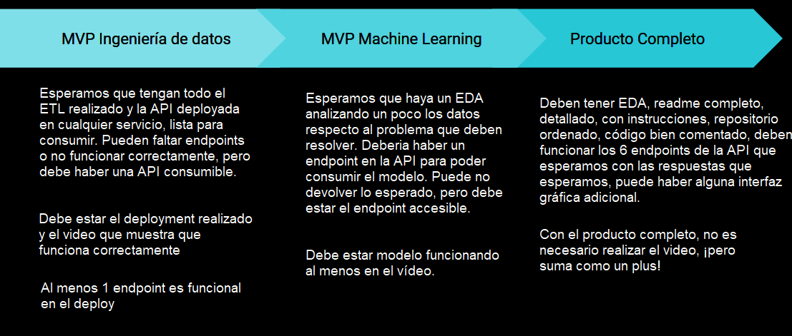

---
# Proyecto Machine Learning Operations Steam
### Introducción
Bienvenidos a mi proyecto de Machine Learning Operations, mi nombre es Juan Camilo Acevedo y me encantó realizar cada parte de él y aprender mucho en el proceso, este es mi primer proyecto haciendo lo que más me gusta, con datos de una de mis actividades favoritas. Gracias por tu interés y tomarte tu tiempo en explorarlo. Documenté cada parte para que sea sencillo entender lo que se realiza en él.
### Descripción
El proyecto presente es una parte de la etapa LABS del Bootcamp para Ciencia de Datos de SoyHenry, donde utilizo todos los conocimientos adquiridos a lo largo de todas las etapas del Bootcamp para llevar a cabo el rol de un MLOps Engineer de Steam, abordando desde la Extracción, Transformación y Carga (ETL) de los datos, hasta la implementación de un sistema de recomendación de video juegos para usuarios en la plataforma Steam.

### Objetivo
El objetivo del proyecto es tener un MVP de una API funcional alojada en un servicio lista para consumir. Dicha API debe cumplir las funciones propuestas más adelante en las tareas desarrolladas y debe implementar también un algoritmo de recomendación de videojuegos.

### Tareas desarrolladas  

1. **Data Engineering**
    
    En esta tarea, se recibieron los conjuntos de datos iniciales: [Juegos de Steam](Data/output_steam_games.json), [Objetos de usuarios Australianos](Data/australian_users_items.json), [Reseñas de usuarios Australianos](Data/australian_user_reviews.json). Ubicados en la carpeta [Data](Data/) en formato .json. Esta tarea se divide en los siguientes pasos:

    - **ETL:** Realizamos esta tarea en los respectivos notebooks: [Juegos](Notebooks/ETL-Games.ipynb), [Reseñas](Notebooks/ETL-Reviews.ipynb) y [Objetos](Notebooks/ETL-Items.ipynb) dentro de la carpeta [Notebooks](Notebooks/).  
    Se realizó una óptima limpieza y transformación de los datos presentes en cada uno de los dataframes, eliminando los valores necesarios para conservar la mayor cantidad de data posible, transformando cada set de datos en una versión mejorada tanto para la API como para el ETL que se usará en el algoritmo de recomendación, todos los criterios de cualquier modificación al set de datos original se encuentran en su respectivo Notebook. Entre las tareas que se realizaron, se realizó un ***Feature Engineering*** en el set de datos de *reseñas*, se requería cambiar la columna 'reseña' por un puntaje dado por un algoritmo que procesara lenguaje natural y reemplazara dicha columna para su uso. 
    Finalmente se exportaron los datos para su uso en las Queries requeridas para cada función de la API y también se exportaron los necesarios para el EDA y algoritmo de recomendación, etiquetados y diferenciados por el final de su nombre siendo _API o _recommend, respectivamente y todos en la carpeta [Data/Processed](Data/Processed) para diferenciarse de los datos iniciales. A excepción del dataframe de reseñas el cual se usará para ambos.  
    **Datos API:** [Juegos](Data/Processed/games_api.csv), [Reseñas](Data/Processed/df_reviews.csv) y [Objetos](Data/Processed/items_api.csv)  
    **Datos EDA:** [Juegos](Data/Processed/games_recommend.csv), [Reseñas](Data/Processed/df_reviews.csv) y [Objetos](Data/Processed/items_recommend.csv)  
    - **Queries:** Luego de procesar los datos iniciales, decidí crear un set de datos individual para cada endpoint requerido en la API, para esto, se usó el Notebook [Queries](Notebooks/Queries.ipynb), en el cual se encuentran, como su nombre lo indica, consultas, en este caso a las bases de datos limpias, esto con el objetivo de brindar a la API unos datos de los cuales pueda elegir fácilmente la respuesta a las solicitudes requeridas por el proyecto. Todo esto dentro de la carpeta [Data/Processed/Query_output](Data/Processed/Query_output) para diferenciarlos de los datos tratados.  
    **Datos:** [developer](Data/Processed/Query_output/developer.csv), [user_data](Data/Processed/Query_output/user_data.csv), [user_for_genre](Data/Processed/Query_output/user_for_genre_year.csv), [best_developer_year](Data/Processed/Query_output/best_developer_year.csv), [developer_review_analysis](Data/Processed/Query_output/developer_reviews_analysis.csv)  
2. **Desarrollo API**

    Se requiere de una API en algún servicio web que funcione para cada endpoint solicitado, para esto se usaron los sets de datos personalizados y se utilizaron librerías como FastAPI junto a Uvicorn y Request para realizar pruebas a los endpoints.

    - **Funcionalidad:** El archivo [funcs.py](Api/funcs.py) contiene las distintas funciones que utilizará la API, entre ellas en este punto no se ha añadido la función del algoritmo de recomendación, pero será añadida en el desarrollo del modelo en este archivo. Adicional a lo que debe retornar cada función, en caso de no encontrar una coincidencia al buscar, retorna una sugerencia de búsqueda de objetos similares disponibles en la columna que se realizará la búsqueda.  
    **Funciones:** 
        - `developer(desarrollador: string):` Retorna la cantidad de items y el porcentaje de esos items que son Free to play (de costo 0$) para el desarrollador ingresado. 
        Debe retornar: `{'dev':{ 'año': {'total_juegos': int, '% free to play': 'XX.XX %' }, 'otro año': {...}, ... } }`  
        - `userdata(id_usuario: string):` Retorna la cantidad de dinero gastado por el usuario, el porcentaje de veces que recomienda un juego y cantidad de juegos. 
        Debe retornar: `{'Usuario':'user_id', 'Dinero gastado': float, '% de recomendación': 'XX.XX %', 'cantidad de items': int}`  
        - `UserForGenre(genero : string):` Retorna, para el género de videojuego ingresado, el usuario con más horas en dicho género, ordenadas por año de lanzamiento. 
        Debe retornar: `{'Usuario con más horas jugadas para Género X' : 'usuario', 'Horas jugadas':[{'Año': 'año', Horas: 'horas'}, {'Año': 'año_2', Horas: 'horas_2'}, {...}, ...]}`  
        - `best_developer_year(año: integer):` Retorna el top 3 de desarrolladores para el año dado, basándose en su cantidad de juegos recomendados y en el puntaje asignado por el análisis de sentimientos en la reseña del usuario, el cual podía ser, negativo, neutral o positivo, para más información de cómo se creó este sistema y cómo se implementó en la función, consultar: [Notebook reseñas](Notebooks/ETL-Reviews.) y [Notebook queries](Notebooks/Queries.ipynb) en el apartado de reviews.  
        Debe retornar: `[{"Puesto 1" : 'dev1'}, {"Puesto 2" : 'dev2'},{"Puesto 3" : 'dev3'}]`  
        - `developer_reviews_analysis( desarrollador : string ):` Retorna para el desarrollador dado, su total de reseñas negativas y positivas, clasificadas en base al análisis de sentimiento. 
        Debe retornar: `{'dev':{'Negative':'count', 'Positive':'count'}}`  
    - **API:** Se realizaron los respectivos endpoints en el archivo [main.py](Api/main.py), el cual en base a las URL retorna el respectivo resultado, manejando errores desde no encontrar un elemento hasta fallos en el servidor o el programa.  
    - **Pruebas:** Usando *Postman*, verifiqué los posibles escenarios en los que una solicitud podía causar respuestas inesperadas, una vez corregidos esos errores, cree un script de pruebas, llamado [test.py](Api/test.py) el cual puede realizar solicitudes en base a las posibles búsquedas, para más información consultar el script.
    - **Deployment:** Se usó Render junto a git y github para el despliegue del proyecto, en este punto la aplicación está lista para ser usada con todo lo mencionado, y a partir de este despliegue, se irá modificando para completar el objetivo del proyecto, los siguientes pasos serán el EDA para lograr entender mejor los datos y crear el algoritmo de recomendación.

3. **Análisis exploratorio de datos EDA** 
En proceso...

4. **Modelo Machine Learning** 
En proceso...  
### Estructura del proyecto 

1. **Fuente de los datos:** Los datos fueron proporcionados en los siguientes enlaces: [Datos](https://drive.google.com/drive/folders/1HqBG2-sUkz_R3h1dZU5F2uAzpRn7BSpj), [Diccionario de los datos](https://docs.google.com/spreadsheets/d/1-t9HLzLHIGXvliq56UE_gMaWBVTPfrlTf2D9uAtLGrk/edit#gid=0). Estos fueron los datos iniciales proporcionados en el [repositorio](https://github.com/soyHenry/PI_ML_OPS/tree/FT?tab=readme-ov-file) del proyecto. 
2. **Mi diccionario de datos:** En los datos creados por medio de los notebooks, el único dato diferente es el de el set de datos de reseñas, el cual en lugar de incluir una columna reseñas, hay una llamada sentiment, la cual contiene el sentimiento de la reseña, siendo 0 para malo, 1 para neutral y 2 para bueno. Para más información de los datos por favor consulte el diccionario citado anterior a este punto, o los [Notebooks](/Notebooks) con los cuales fueron generados.
3. **Directorios:** En el directorio raíz se encuentran las carpetas: 
    - [Api](Api/) - Contiene las [funciones](Api/funcs.py), el [archivo principal](Api/main.py) y el [archivo de pruebas](Api/test.py) de la API.
    - [Data](Data/) - Contiene todos los dataframes usados en el proyecto, desde los iniciales en la misma carpeta, hasta los tratados en la carpeta de [procesados](Data/Processed/), y los específicos para las funciones en la carpeta de [salida de las consultas](Data/Processed/Query_output/).
    - [imgs](imgs/) - Contiene las imágenes usadas en el proyecto.
    - [Notebooks](Notebooks/) - Contiene cada notebook usado en el proyecto, con su respectivo nombre indicando su función y el set de datos al que fue destinada su creación. Queries.ipynb trata todos los datos para las funciones.
    - **Otros** - Repositorios necesarios para git y github como este readme.
4. **MVP:** 

