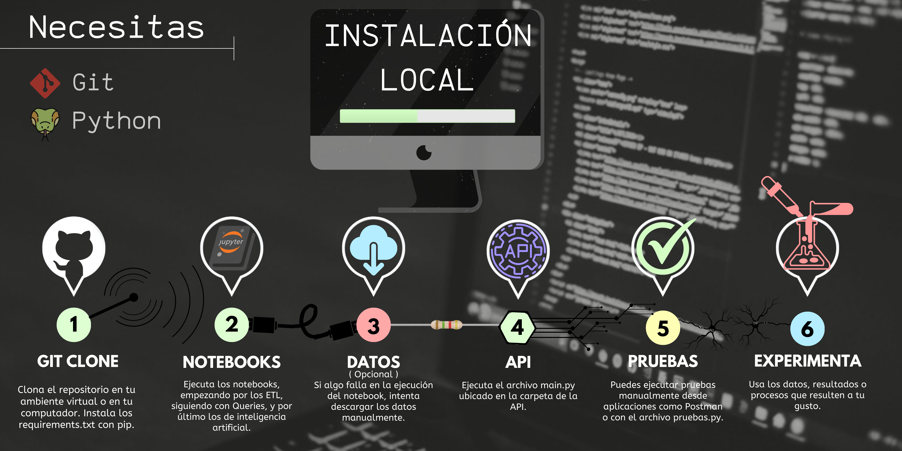

---
# Proyecto Machine Learning Operations Steam
## Introducción
Bienvenidos a mi proyecto de Machine Learning Operations, mi nombre es Juan Camilo Acevedo y me encantó realizar cada parte de él y aprender mucho en el proceso, este es mi primer proyecto haciendo lo que más me gusta, con datos de una de mis actividades favoritas. Gracias por tu interés y tomarte tu tiempo en explorarlo. Documenté cada parte para que sea sencillo entender lo que se realiza en él.
- Enlace API: https://juan-acevedo-ml-ops.onrender.com
- Enlace API Con interfaz Gráfica : [API_GUI](https://juan-acevedo-ml-ops.onrender.com/docs)

## Indice
[Descripción](#descripción) - [Objetivo](#objetivo) - [Tareas desarrolladas](#tareas-desarrolladas) - [Estructura del proyecto](#estructura-del-proyecto) - [Instrucciones de instalación y uso](#instrucciones-de-instalación-y-uso) 
### Descripción
El proyecto presente es una parte de la etapa LABS del Bootcamp para Ciencia de Datos de SoyHenry, donde utilizo todos los conocimientos adquiridos a lo largo de todas las etapas del Bootcamp para llevar a cabo el rol de un MLOps Engineer de Steam, abordando desde la Extracción, Transformación y Carga (ETL) de los datos, hasta la implementación de un sistema de recomendación de video juegos para usuarios en la plataforma Steam.

## Objetivo
El objetivo del proyecto es tener un MVP de una API funcional alojada en un servicio lista para consumir. Dicha API debe cumplir las funciones propuestas más adelante en las tareas desarrolladas y debe implementar también un algoritmo de recomendación de videojuegos, el cual, en base a un id de un juego, o de un id de un usuario, recomiende otro similar al juego ingresado, o que le pueda gustar al usuario, esto se debe implementar en la API al igual que las funciones descritas más adelante.

## Tareas desarrolladas

1. **Data Engineering**
    
    En esta tarea, se recibieron los conjuntos de datos iniciales: [steam_games.json.gz](Data/steam_games.json.gz), [australian_users_items.json.gz](Data/australian_users_items.json.gz), [australian_user_reviews.json.gz](Data/australian_user_reviews.json.gz), los cuales el catalogo de juegos, el inventario de los usuarios Australianos y sus reseñas respectivamente, estos datos no se subieron al repositorio ya que son muy pesados, deben estar ubicados en la carpeta [Data](Data/) que es la carpeta a la cual apuntan los Notebooks, y deben tener su mismo nombre, la descarga de estos datos se realiza automáticamente desde los Notebooks ETL, pero puedes descargar estos datos manualmente desde aquí: [Datos](https://drive.google.com/drive/u/0/folders/1dqsrIyq_ucgHjAgol6ajr5Zc8ZABdqIN). Esto lo profundizamos más adelante en las [instrucciones de instalación y uso](#instrucciones-de-instalación-y-uso).<br>
    Esta tarea se divide en los siguientes pasos:

    - **ETL:** Realizamos esta tarea en los respectivos notebooks: [Juegos](Notebooks/ETL-Games.ipynb), [Reseñas](Notebooks/ETL-Reviews.ipynb) y [Objetos](Notebooks/ETL-Items.ipynb) dentro de la carpeta [Notebooks](Notebooks/).  
    Se realizó una óptima limpieza y transformación de los datos presentes en cada uno de los dataframes, eliminando los valores necesarios para conservar la mayor cantidad de data posible, transformando cada set de datos en una versión mejorada tanto para la API como para el EDA que se usará en el algoritmo de recomendación, todos los criterios de cualquier modificación al set de datos original se encuentran en su respectivo Notebook. Entre las tareas que se realizaron, se realizó un ***Feature Engineering*** en el set de datos de *reseñas*, se requería cambiar la columna 'reseña' por un puntaje dado por un algoritmo que procesara lenguaje natural y reemplazara dicha columna para su uso.<br>
    Finalmente se exportaron los datos para su uso en las Queries requeridas para cada función de la API y también se exportaron los necesarios para el EDA y algoritmo de recomendación, todos en la carpeta [Data/Processed](Data/Processed) para diferenciarse de los datos iniciales. el dataframe de juegos, se divide en una parte que se usará en la API, y otra que se usará en el algoritmo de recomendación. Esta decisión se explica en el [notebook del ETL de juegos](Notebooks/ETL-Games.ipynb).<br>
    **Datos Limpios:** [Juegos_api](Data/Processed/games_api.csv), [Reseñas](Data/Processed/df_reviews.csv), [Objetos](Data/Processed/items_api.csv) y [Juegos_eda](Data/Processed/games_recommend.csv).<br>

    - **Queries:** Luego de procesar los datos iniciales, decidí crear un set de datos individual para cada endpoint requerido en la API, para esto, se usó el Notebook [Queries](Notebooks/Queries.ipynb), en el cual se encuentran, como su nombre lo indica, consultas, en este caso a las bases de datos limpias, esto con el objetivo de brindar a la API unos datos de los cuales pueda elegir fácilmente la respuesta a las solicitudes requeridas por el proyecto. Todo esto dentro de la carpeta de [datos de la api](Api/ApiData) para diferenciarlos de los datos tratados.<br>
    **Datos resultantes:** [developer](Api/ApiData/developer.csv), [user_data](Api/ApiData/user_data.csv), [user_for_genre](Api/ApiData/user_for_genre_year.csv), [best_developer_year](Api/ApiData/best_developer_year.csv), [developer_review_analysis](Api/ApiData/developer_reviews_analysis.csv)<br><br>
2. **Desarrollo API**

    Se requiere de una API en algún servicio web que funcione para cada endpoint solicitado, para esto se usaron los sets de datos personalizados y se utilizaron librerías como FastAPI junto a Uvicorn y Request para realizar pruebas a los endpoints.

    - **Funcionalidad:** El archivo [funcs.py](Api/funcs.py) contiene las distintas funciones que utilizará la API, entre ellas en este punto no se ha añadido la función del algoritmo de recomendación, pero será añadida en el desarrollo del modelo en este archivo. Adicional a lo que debe retornar cada función, en caso de no encontrar una coincidencia al buscar, retorna una sugerencia de búsqueda de objetos similares disponibles en la columna que se realizará la búsqueda.<br>
    **Funciones:**<br>
        - `developer(desarrollador: string):` Retorna la cantidad de items y el porcentaje de esos items que son Free to play (de costo 0$) para el desarrollador ingresado.<br>
        Debe retornar: `{'dev':{ 'año': {'total_juegos': int, '% free to play': 'XX.XX %' }, 'otro año': {...}, ... } }`<br><br>
        - `userdata(id_usuario: string):` Retorna la cantidad de dinero gastado por el usuario, el porcentaje de veces que recomienda un juego y cantidad de juegos.<br>
        Debe retornar: `{'Usuario':'user_id', 'Dinero gastado': float, '% de recomendación': 'XX.XX %', 'cantidad de items': int}`<br><br>
        - `UserForGenre(genero : string):` Retorna, para el género de videojuego ingresado, el usuario con más horas en dicho género, ordenadas por año de lanzamiento.<br>
        Debe retornar: `{'Usuario con más horas jugadas para Género X' : 'usuario', 'Horas jugadas':[{'Año': 'año', Horas: 'horas'}, {'Año': 'año_2', Horas: 'horas_2'}, {...}, ...]}`<br><br>
        - `best_developer_year(año: integer):` Retorna el top 3 de desarrolladores para el año dado, basándose en su cantidad de juegos recomendados y en el puntaje asignado por el análisis de sentimientos en la reseña del usuario, el cual podía ser, negativo, neutral o positivo, para más información de cómo se creó este sistema y cómo se implementó en la función, consultar: [Notebook reseñas](Notebooks/ETL-Reviews.ipynb) y [Notebook queries](Notebooks/Queries.ipynb) en el apartado de reviews.<br>
        Debe retornar: `[{"Puesto 1" : 'dev1'}, {"Puesto 2" : 'dev2'},{"Puesto 3" : 'dev3'}]`<br><br>
        - `developer_reviews_analysis( desarrollador : string ):` Retorna para el desarrollador dado, su total de reseñas negativas y positivas, clasificadas en base al análisis de sentimiento.<br>
        Debe retornar: `{'dev':{'Negative':'count', 'Positive':'count'}}`<br><br>
    - **API:** Se realizaron los respectivos endpoints en el archivo [main.py](Api/main.py), el cual en base a las URL retorna el respectivo resultado, manejando errores desde no encontrar un elemento hasta fallos en el servidor o el programa.<br><br>
    - **Pruebas:** Usando *Postman*, verifiqué los posibles escenarios en los que una solicitud podía causar respuestas inesperadas, una vez corregidos esos errores, cree un script de pruebas, llamado [test.py](test.py) el cual puede realizar solicitudes en base a las posibles búsquedas, para más información consultar el script.<br><br>
    - **Deployment:** Se usó Render junto a git y github para el despliegue del proyecto, en este punto la aplicación está lista para ser usada con todo lo mencionado, y a partir de este despliegue, se irá modificando para completar el objetivo del proyecto, los siguientes pasos serán el EDA para lograr entender mejor los datos y crear el algoritmo de recomendación. Render sólo usa la carpeta API para obtener un mejor rendimiento, siendo esta carpeta la que alberga todo lo necesario para la API, mientras que en el repositorio se encuentra lo necesario para correr el archivo localmente, por eso los requirements de API son distintos.

3. **Análisis exploratorio de datos EDA**<br>
En proceso...

4. **Modelo Machine Learning**<br>
En proceso...<br><br>
### Estructura del proyecto

1. **Fuente de los datos:** Los datos fueron proporcionados en los siguientes enlaces: [Datos opcion 1](https://drive.google.com/drive/folders/1HqBG2-sUkz_R3h1dZU5F2uAzpRn7BSpj),[Datos opcion 2](https://drive.google.com/drive/u/0/folders/1dqsrIyq_ucgHjAgol6ajr5Zc8ZABdqIN), [Diccionario de los datos](https://docs.google.com/spreadsheets/d/1-t9HLzLHIGXvliq56UE_gMaWBVTPfrlTf2D9uAtLGrk/edit#gid=0). Estos fueron los datos iniciales proporcionados en el [repositorio](https://github.com/soyHenry/PI_ML_OPS/tree/FT?tab=readme-ov-file) de la propuesta del proyecto.<br>
2. **Mi diccionario de datos:** En los datos creados por medio de los notebooks, el único dato diferente es el de el set de datos de reseñas, el cual en lugar de incluir una columna reseñas, hay una llamada sentiment, la cual contiene el sentimiento de la reseña, siendo 0 para malo, 1 para neutral y 2 para bueno. Para más información de los datos por favor consulte el diccionario citado anterior a este punto, o los [Notebooks](/Notebooks) con los cuales fueron generados.
3. **Directorios:** En el directorio raíz se encuentran las carpetas:<br>
    - [Api](Api/) - Contiene las [funciones](Api/funcs.py), el [archivo principal](Api/main.py)
    - [ApiData](Api/ApiData) - Contiene las salidas de las Queries ejecutadas para crear un set de datos óptimo para cada función que se use en la API.
    - [Data](Data/) - Será la ubicación donde se descarguen los datos desde los ETL notebooks y donde lleguen los datos procesados y limpios de dichos notebooks a la carpeta: [procesados](Data/Processed/).
    - [assets](assets/) - Contiene las imágenes y otros recursos usados en el proyecto.
    - [Notebooks](Notebooks/) - Contiene los notebooks ETL, con los cuales se realizó la primera limpieza a los datos crudos, también, el notebook Queries, el cual se usó para crear los dataframes específicos para cada función.
    - [Machine Learning](MachineLearning/) - Contiene el notebook de el [EDA]() y el de [Inteligencia artificial](), usados para crear los datos que usará el algoritmo de recomendación.
    - **Otros** - Archivos necesarios para git y github como este readme. Y archivo de pruebas automatizadas para la API [test.py](test.py).

## Instrucciones de instalación y uso
<br><br>1. **Clona el repositorio:** Utiliza el comando:
```
git clone https://github.com/Aeregon-Sharks/Steam-ML-Ops.git
```  
para descargar el repositorio en la carpeta que decidas ejecutar la consola de git.<br><br>
2. **Descarga los requerimientos:** Ejecuta:
```
pip install -r requirements.txt
```  
en el directorio principal en el que pusiste el proyecto, o en tu ambiente virtual.<br><br>
3. **Ejecuta los notebook ETL:** Los notebook se encuentran en la carpeta [Notebooks](Notebooks/) , corre todas las celdas de los notebook que tengan en su nombre ETL, esto hará que empiece la limpieza de los sets de datos, que si no están en tu dispositivo, se deberían descargar automáticamente, si esto no ocurre y algún Notebook da un error, intenta descargarlos manualmente y ponerlos en la carpeta Data/, con el nombre referenciado en el notebook, por defecto los nombres serán: `steam_games.json.gz , user_reviews.json.gz y users_items.json.gz`. [Datos opcion 1](https://drive.google.com/drive/folders/1HqBG2-sUkz_R3h1dZU5F2uAzpRn7BSpj), [Datos opcion 2](https://drive.google.com/drive/u/0/folders/1dqsrIyq_ucgHjAgol6ajr5Zc8ZABdqIN) [Diccionario de los datos](https://docs.google.com/spreadsheets/d/1-t9HLzLHIGXvliq56UE_gMaWBVTPfrlTf2D9uAtLGrk/edit#gid=0).<br><br>
4. **Ejecuta el notebook Queries:** En la misma carpeta, ejecuta todas las celdas del Notebook Queries, recuerda que para todos los notebooks, hay información en ellos sobre los criterios para cada decisión que modificó a los datos, no dudes en consultarme si algo falla y no se encuentra ninguna indicación en el notebook.<br><br>
5. **Ejecuta el notebook de EDA:** En la carpeta Machine Learning se encuentra todo lo relacionado a la segunda parte del proyecto, ahí podrás ejecutar el cuaderno para visualizar el Análisis de Datos Exploratorio.<br><br>
6. **Ejecuta el notebook de Machine Learning** En la misma carpeta, ejecuta el notebook de MachineLearning.<br><br>
7. **Ejecuta main.py:** Una vez se terminen de ejecutar todos los notebooks, ejecuta el archivo [main.py](Api/main.py) que se encuentra en la carpeta [Api](Api/) usando uvicorn.<br><br>
Si estás ubicado en la raíz:
```
uvicorn Api.main:app
```
Si estás ubicado en la carpeta API:
```
uvicorn main:app
```
\
8. **Pruebas:** Ejecuta pruebas a las solicitudes ya sea localmente con programas como postman, o usando el archivo [test.py](Api/test.py) ubicado en la misma carpeta de la API. Recuerda hacer pruebas a la dirección ip que te muestre Uvicorn en la consola, y modificar el archivo test.py con la dirección ip y las pruebas que necesites realizar.